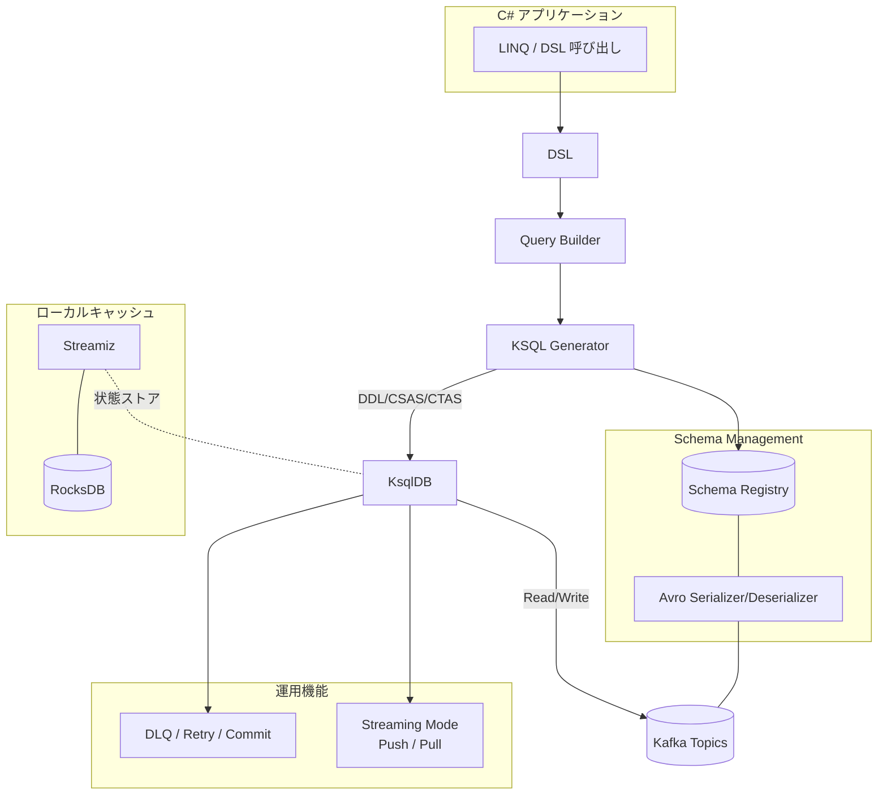
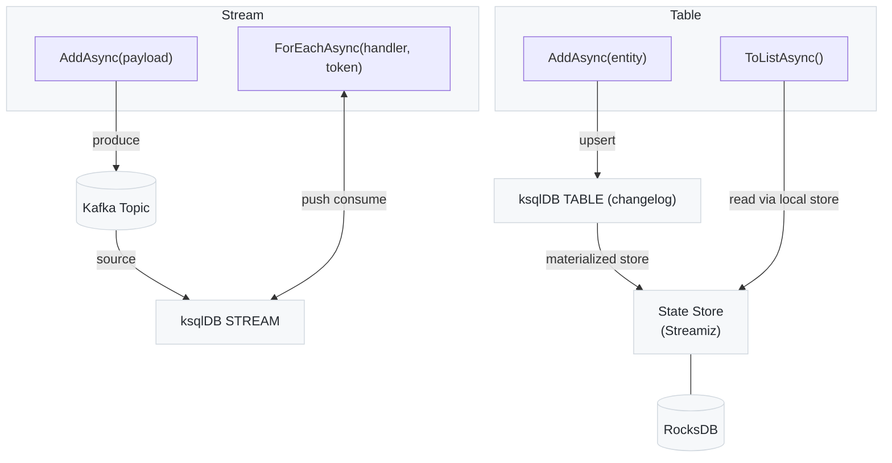

#  &nbsp; &nbsp; Kafka.Ksql.Linq &nbsp;&nbsp;

## 概要
- LINQ で Kafka/ksqlDB を操作する C# ライブラリ
- Avro + Schema Registry を前提とした型安全な DSL
- Streams/Tables, Pull/Push をサポート（実行モードは自動推論）
- エラー処理（DLQ）/ リトライ / コミットの運用補助

## クイックスタート（ローカルで10分）
```
git clone <repository-url>
cd rc02
dotnet restore

docker-compose -f tools/docker-compose.kafka.yml up -d

# 実行例（examples は順次追加中）
# cd examples/hello-world && dotnet run

public class HelloMessage
{
    public int Id { get; set; }
    public string Text { get; set; } = string.Empty;
}

public class HelloKafkaContext : KsqlContext
{
    public HelloKafkaContext(KsqlContextOptions options) : base(options.Configuration!, options.LoggerFactory) { }
    public HelloKafkaContext(Microsoft.Extensions.Configuration.IConfiguration configuration, Microsoft.Extensions.Logging.ILoggerFactory? loggerFactory = null) : base(configuration, loggerFactory) { }
    public EventSet<HelloMessage> HelloMessages { get; set; }
    protected override void OnModelCreating(IModelBuilder modelBuilder)
    {
    }
}

class Program
{
    static async Task Main(string[] args)
    {
        var configuration = new ConfigurationBuilder()
            .AddJsonFile("appsettings.json")
            .Build();

        await using var context = new HelloKafkaContext(configuration, LoggerFactory.Create(b => b.AddConsole()));

        var message = new HelloMessage
        {
            Id = Random.Shared.Next(),
            Text = "Hello World"
        };
        await context.HelloMessages.AddAsync(message);
        await context.HelloMessages.ForEachAsync(m =>
        {
            Console.WriteLine($"Received: {m.Text}");
            return Task.CompletedTask;
        });
    }
}
```


## 構成イメージ
1) DSL 全体アーキテクチャ図

2) Produce / Consume と API（Stream・Table・RocksDB）


## 例（Examples）
- 目次: `docs/examples/index.md`
- OnModelCreating サンプル集: `docs/onmodelcreating_samples.md`

## ドキュメント（リファレンス）
- 関数/型対応表: `docs/ksql-function-type-mapping.md`
- SQLServer→ksqlDB ガイド: `docs/sqlserver-to-kafka-guide.md`
- API: `docs/api_reference.md`
- Configuration: `docs/configuration_reference.md`
- Advanced: `docs/advanced_rules.md`

## ライセンス / ロードマップ
- License: [MIT License](./LICENSE)
- Docs: 一部 CC BY 4.0 を想定
- Roadmap（例）
  - 安定化と examples 追加
  - .NET 10 対応


## Acknowledgements
- [Acknowledgements](./docs/acknowledgements.md)
