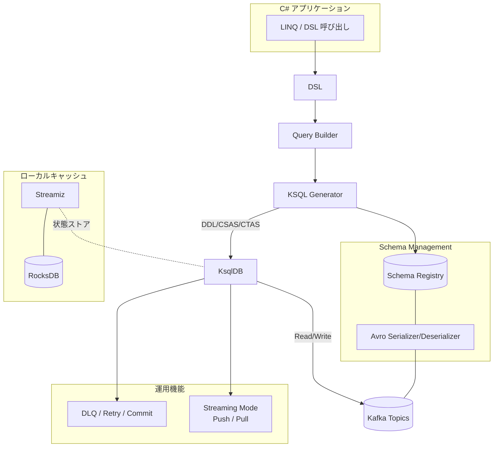
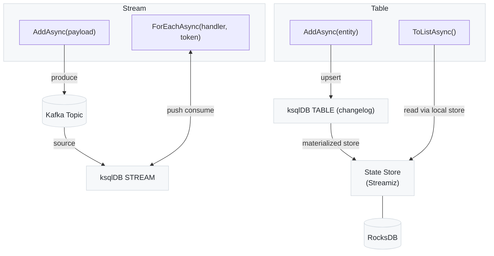

#  Kafka.Ksql.Linq &nbsp;

## 特徴
- LINQ ライクに Kafka/ksqlDB を扱える
- Avro + Schema Registry 対応の型安全 DSL
- Window/集約処理や Push/Pull クエリ対応
- DLQ / Retry / Commit を含むエラーハンドリング

## Quick Start
```
git clone <repository-url>
cd rc02
dotnet restore

docker-compose -f tools/docker-compose.kafka.yml up -d

cd examples/hello-world
dotnet run
```
## structure
1) DSL 全体アーキテクチャ図

2) Produce / Consume と API（Stream・Table・RocksDB）


## Examples
- サンプル一覧: [exsamples/index.md](./examples/index.md)

## Reference
- API: docs/api_reference.md
- Configuration: docs/configuration_reference.md
- Advanced: docs/advanced_rules.md

## License
- ソースコードは [MIT License](./LICENSE) の下で公開
- ドキュメントは [Creative Commons Attribution 4.0 International (CC BY 4.0)](https://creativecommons.org/licenses/by/4.0/) の下で公開

## Roadmap
- 2025 Q4
  - Oneshot対応: ksqldbに単発登録を行うPod構成に対応する機能を提供
  - .NET 10 対応: 最新ランタイムでの動作保証


## Acknowledgements
　- [Acknowledgements](./docs/acknowledgements.md)