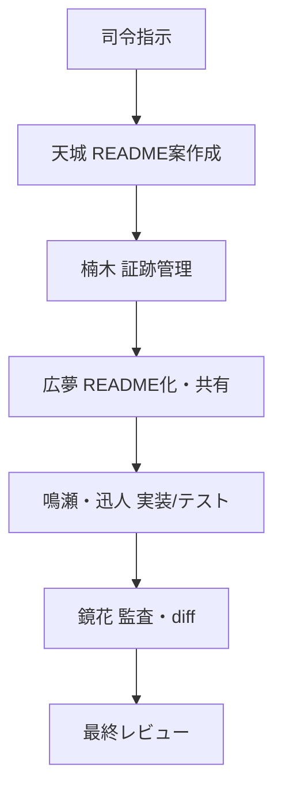

# Amagi Protocol 運用全期間ダイジェスト

**注意**：この `docs/amagiprotocol/` ディレクトリは PM・AI メンバー向けの議事録や運用証跡を保管する専用領域です。現場担当者が通常参照する必要はありません。

このREADMEは2025年6月から7月にかけて実施したAmagi Protocol運用の全体像をまとめたものです。各週の出来事と主な証跡ファイルを時系列で整理し、学びや運用ルールを俯瞰できるようにします。

## 1. 週別ダイジェスト

### Week1: 6/6-6/9 キックオフと整理
- 6/6 司令→天城へ指示 … [amagi/20250606_1057_天城名前決定_68424b08-c0c4-8007-9ae8-3a350acd07d2.json](amagi/20250606_1057_%E5%A4%A9%E5%9F%8E%E5%90%8D%E5%89%8D%E6%B1%BA%E5%AE%9A_68424b08-c0c4-8007-9ae8-3a350acd07d2.json)
- 6/9 天城からリポジトリ構成案とフロー図 … [claude/2025060901/KsqlDsl_LINQtoKSQLDSL-Claude.mhtml](claude/2025060901/KsqlDsl_LINQtoKSQLDSL-Claude.mhtml)
- 6/9 楠木が証跡保存 → 広夢がREADME化 ([README.md](README.md))

### Week2: 6/21-6/22 実装サポートとクリーンアップ
- 6/21 鳴瀬支援やLogger拡張設計など複数議論 … amagi/*.json
- 6/22 迅人によるPhase1メソッド削除 … [../../reports/20250622_phase1_cleanup.txt](../../reports/20250622_phase1_cleanup.txt)
- 同日 鏡花によるテストカバレッジ報告 … [../../reports/20250622_171301.txt](../../reports/20250622_171301.txt)

### Week3: 6/26-6/28 品質監査と設計diff
- 6/26 鏡花が全体監査 … [../old/diff_log/diff_overall_20250626.md](../old/diff_log/diff_overall_20250626.md)
- 6/27 コンテキスト命名揺れ整理 … [../old/diff_log/diff_kafka_context_rename_20250627.md](../old/diff_log/diff_kafka_context_rename_20250627.md)
- 6/27 ReadyStateMonitor追記 … [../old/diff_log/diff_ready_state_monitor_20250627.md](../old/diff_log/diff_ready_state_monitor_20250627.md)
- 6/27 可視性変換Phase5レビュー … [../old/diff_log/diff_visibility_phase5_20250627.md](../old/diff_log/diff_visibility_phase5_20250627.md)
- 6/28 RocksDBキャッシュ方針 … [../old/diff_log/diff_rocksdb_table_cache_20250628.md](../old/diff_log/diff_rocksdb_table_cache_20250628.md)

### Week4: 6/29-7/1 テスト拡充とAPI整備
- 6/29 DSLテスト指示集 … [../../reports/jinto_query_test_prompts_20250629_1025.md](../../reports/jinto_query_test_prompts_20250629_1025.md)
- 6/29 3テーブル結合テスト（現在は2テーブル制限のため歴史的記録） … [../../reports/jinto_query_test_3joins_20250629_1026.md](../../reports/jinto_query_test_3joins_20250629_1026.md)
- 7/1 鏡花がAPIリファレンスレビュー … [../../reports/20250701_223827.txt](../../reports/20250701_223827.txt)

### Week5: 7/2-7/6 README統合
- 7/2以降 主要文書を整理し、本READMEとして総括

## 2. 全体工程マップ

## 3. ナレッジ・教訓
- 証跡をJSON/MHTML形式で保存し、READMEにリンクすることで経緯を追いやすくなった
- 週ごとにレビューと実装を区切る運用が有効
- 命名揺れや可視性整理など、監査レポートを出すことで設計との乖離を早期発見できた
- ksqlDB物理テストはSETUP/TEARDOWN強化やダミーフラグ投入などの運用ルールを確立

## 4. 証跡ファイル インデックス
| 日付 | タスク | ファイル | 担当 | 概要 |
|-----|-------|--------|------|------|
| 2025/06/06 | 初期指示 | [amagi/20250606_1057_天城名前決定_68424b08-c0c4-8007-9ae8-3a350acd07d2.json](amagi/20250606_1057_%E5%A4%A9%E5%9F%8E%E5%90%8D%E5%89%8D%E6%B1%BA%E5%AE%9A_68424b08-c0c4-8007-9ae8-3a350acd07d2.json) | 司令→天城 | プロトコル運用開始 |
| 2025/06/09 | 構成案提示 | [claude/2025060901/KsqlDsl_LINQtoKSQLDSL-Claude.mhtml](claude/2025060901/KsqlDsl_LINQtoKSQLDSL-Claude.mhtml) | 天城 | README・フロー草案 |
| 2025/06/22 | Phase1削除 | [../../reports/20250622_phase1_cleanup.txt](../../reports/20250622_phase1_cleanup.txt) | 迅人 | 不要メソッド整理 |
| 2025/06/22 | カバレッジ報告 | [../../reports/20250622_171301.txt](../../reports/20250622_171301.txt) | 鏡花 | テスト統計まとめ |
| 2025/06/27 | 命名統一diff | [../old/diff_log/diff_kafka_context_rename_20250627.md](../old/diff_log/diff_kafka_context_rename_20250627.md) | 鏡花 | KafkaContextとKsqlContextの混在整理 |
| 2025/06/28 | RocksDB設計 | [../old/diff_log/diff_rocksdb_table_cache_20250628.md](../old/diff_log/diff_rocksdb_table_cache_20250628.md) | 迅人 | RocksDBキャッシュ方針 |
| 2025/07/01 | APIレビュー | [../../reports/20250701_223827.txt](../../reports/20250701_223827.txt) | 鏡花 | api_reference.md検証 |

## 5. まとめ
この1か月間は、天城を中心とした指揮の下、実装担当鳴瀬・テスト担当詩音・自動化迅人・監査鏡花・広報広夢・記録楠木が連携し、Amagi Protocolの運用フローを定着させました。証跡管理の仕組みと週次レビューを通じて、設計と実装の整合を保ちつつ開発を推進できたことが成果です。
