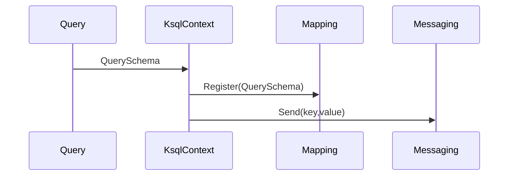

# Query から KsqlContext への Mapping/Serialization フロー

🗕 2025年7月20日（JST）
🧐 作成者: くすのき

このドキュメントでは、Query DSL で組み立てたクエリがどのように `KsqlContext` を経由して `Messaging` 層へ届くのか、流れと役割分担を解説します。各レイヤーの責務を理解することで、実装時に迷わず最適な構成を選択できます。

## 1. 目的
1. Query では LINQ 式から `QuerySchema` を生成します。
2. `KsqlContext` は `QuerySchema` を登録し、`MappingRegistry` を初期化します。
3. `MappingRegistry` は POCO ⇔ Key/Value 変換を行い、Avro 型情報を提供します。
4. Messaging はシリアライズ済みのキーと値を送受信します。

## 2. レイヤー別の責務
| レイヤー | 主なクラス/IF | 責務概要 |
| --- | --- | --- |
| Query | `IEntitySet<T>`, `QueryAnalyzer` | LINQ 解析と `QuerySchema` 生成 |
| KsqlContext | `KsqlContext`, `KsqlContextBuilder` | `QuerySchema` 登録と MappingRegistry への橋渡し |
| Mapping | `MappingRegistry` | POCO ⇔ Key/Value 変換を管理 |
| Messaging | `KafkaProducerManager`, `KafkaConsumerManager` | Avro 変換後の送受信 |

## 3. データフロー

1. `IEntitySet<T>` から `QueryAnalyzer` が `QuerySchema` を生成します。
2. `KsqlContext` が `MappingRegistry` にスキーマを登録します。
3. 作成した Key/Value を Messaging 層に送信します。

## 4. サンプルコード
```csharp
// LINQ クエリを解析してスキーマを取得
var result = QueryAnalyzer.Analyze<User, User>(q => q.Where(u => u.Id == 1));
var schema = result.Schema!;

// KsqlContext にスキーマを登録
var ctx = new MyKsqlContext(options);
ctx.RegisterQuerySchema<User>(schema);

// POCO を直接送信
await ctx.Set<User>().AddAsync(user);
```

## 5. ベストプラクティス
- `QueryAnalyzer` から得たスキーマは再利用し、毎回解析し直さないようにしましょう。
- `KsqlContext` はスコープごとに生成し、長時間の使い回しは避けます。
- 送信前に生成された KSQL 文をログで確認するとデバッグが容易になります。
- Serializer/Deserializer のキャッシュを有効にし、性能を安定させてください。
- エラー時は `AddAsync` をリトライポリシー付きで呼び出します。

## 6. 参考資料
- [key_value_flow.md](./key_value_flow.md) – 各レイヤーの関係整理
- [api_reference.md の Fluent API ガイドライン](../api_reference.md#fluent-api-guide)

## 7. 最新更新 (2025-08-24)
MappingRegistry と `AddAsync` の直接送信に合わせて、コード例とフローを刷新しました。
