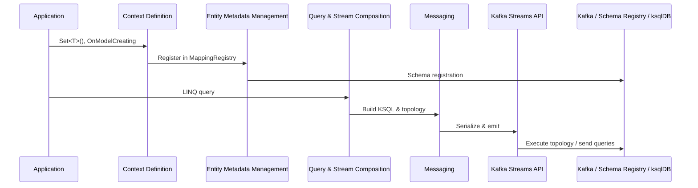

## 🏗️ Architecture Overview（全体構造と各層の責務）

本ドキュメントは Kafka.Ksql.Linq OSS の **内部設計ドキュメント** として、アーキテクチャ全体と各レイヤーの責務を明確化することを目的としています。

⚠️ DSL 利用者向けの概要ではなく、OSS 本体の改変・拡張に関わる開発者向け資料です。

---

### 🗂️ 全体レイヤー一覧
1. Application層
2. Context定義層
3. Entity Metadata管理層
4. クエリ・ストリーム構成層
5. Messaging層
6. Kafka Streams API層
7. Kafka / Schema Registry / ksqlDB 基盤層

### 📊 レイヤー構造図
```mermaid
graph TB
    A[Application\nSet&lt;T&gt;() and OnModelCreating] --> B[Context Definition\nKsqlContext & KsqlModelBuilder\nMappingRegistry]
    B --> C[Entity Metadata Management\nMappingRegistry]
    C --> D[Query & Stream Composition\nLINQ→KSQL, KStream/KTable]
    D --> E[Messaging\nSerialization, DLQ]
    E --> F[Kafka Streams API]
    F --> G[Kafka / Schema Registry / ksqlDB]
```

### 🧱 レイヤー構造と責務

| レイヤー名                       | 主な責務概要                                                                 | 代表Namespace / 主なクラス |
|----------------------------------|------------------------------------------------------------------------------|----------------------------|
| Application層                   | DSL記述（`KsqlContext`継承 + `OnModelCreating` + `Set<T>()` 定義）          | `samples`, `src/Application` |
| Context定義層                   | DSL解析とモデル構築（`KsqlContext`, `KsqlModelBuilder`, `MappingRegistry`） | `src/Core` |
| Entity Metadata管理層           | POCO属性解析と `MappingRegistry` による Kafka/Schema Registry 設定管理     | `src/Mapping` |
| クエリ・ストリーム構成層       | LINQ式解析、KSQL生成、KStream/KTable構成、Window処理、Join、Final出力など | `src/Query`, `src/EventSet` |
| Messaging層                    | メッセージのシリアライズ/デシリアライズ、DLQ連携、Kafka Streams への橋渡し | `src/Messaging` |
| Kafka Streams API層            | Kafka Streams トポロジ実行、ksqldb へのクエリ送信                          | Streamiz.Kafka.Net |
| Kafka / Schema Registry / ksqlDB 基盤層 | クラスタ運用、スキーマ管理、KSQL 実行環境                     | Kafka, Schema Registry, ksqlDB |

### 🔄 レイヤー間の典型的なデータフロー
以下のシーケンス図は `Set<T>()` でのエンティティ登録から Kafka プラットフォームへの到達までの代表的な流れを示します。



各レイヤーの詳細構造や主なクラスについては、`docs/namespaces/` 配下にて Namespace 単位で説明されます。

---

### 🔁 他ドキュメントとの関係

- `docs_configuration_reference.md` → DSLとappsettingsのマッピング解説
- `docs_advanced_rules.md` → 運用時の制約と設計判断の背景
- `dev_guide.md` → 機能追加・DSL拡張手順の実装ルール
- `docs/namespaces/*.md` → 各層に対応するNamespaceごとの実装責務と拡張ポイント

---

本ドキュメントは、設計構造の俯瞰と責務分離の理解を促すものであり、拡張時の出発点・索引として活用されます。

※ 図解や依存関係マップは別紙予定

---

## POCO設計・PK運用・シリアライズ方針

本節では OSS における POCO 設計方針、PK 運用およびシリアライズ/デシリアライズのポリシーをまとめます。内容は [reports/20250708.txt](../reports/20250708.txt) をもとに、鏡花・楠木・広夢が整理しました。これらの変換は `Set<T>()` で登録されたエンティティを `MappingRegistry` が自動処理します。

### 1. POCO 設計原則
- 業務 POCO は **純粋な業務データ構造** とし、キー指定用の属性は付与しない。
- DB 都合やビジネスロジック都合で自由に設計し、Kafka の key schema を意識しない。

### 2. PK 運用ルール
- PK (key schema) は DTO/POCO の **プロパティ定義順** のみを基準に自動生成する。
- `Key` 属性は設計・実装から除外し、複合キーの順序は DTO/POCO の定義順に従う。
- キーに利用できる型は `int` `long` `string` `Guid` の4種類のみとし、その他は利用者側で変換する。
- LINQ `group by` などで指定した論理 PK の順序と一致させる。
- `GroupBy` や `Join` で生成されるキー順と DTO/POCO の定義順が一致しない場合、初期化時に `InvalidOperationException` を送出する。
  エラーメッセージは **"GroupByキーの順序と出力DTOの定義順が一致していません。必ず同じ順序にしてください。"** とする。

### 3. シリアライズ／デシリアライズ方針
- POCO ⇔ key/value 構造体の変換は **完全自動** で実行する。
- Produce 時は DTO/POCO から PK 部と Value 部を自動分離してシリアライズする。
- Consume 時は Kafka から受信した key/value をデシリアライズし、 DTO/POCO に再構成する。
- シリアライザ／デシリアライザは型・スキーマ毎にキャッシュし性能を確保する。

### 4. 運用上のポイント
- 以上の方針は全ドキュメント・ガイドに明記し、チーム全員で遵守する。
- 進捗や課題があれば天城（PM）へ随時エスカレーションする。

作成: 広夢 / 監修: 鏡花・楠木

### 関連ドキュメント
- [getting-started.md](./getting-started.md)
- [docs_advanced_rules.md](./docs_advanced_rules.md)
- [Set<T>() から Messaging までの利用ストーリー](./architecture/entityset_to_messaging_story.md)
- [Key-Value Flow Architecture (POCO ↔ Kafka)](./architecture/key_value_flow.md)
- [Query -> KsqlContext -> Mapping/Serialization Flow](./architecture/query_ksql_mapping_flow.md)
- [Query to AddAsync Flow Sample](./architecture/query_to_addasync_sample.md)

