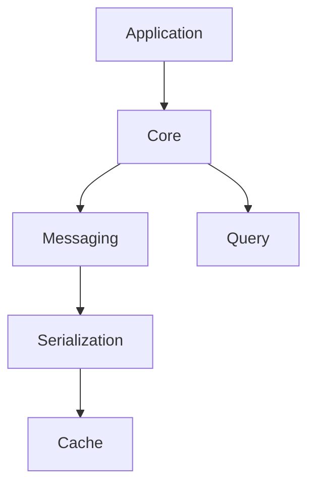

# Kafka.Ksql.Linq OSS 統合責務サマリ

---

## 🔎 全体構造・namespaceごとの一言責務

| Namespace         | 主な責務（1行サマリ）                                                 |
|-------------------|--------------------------------------------------------------------|
| **Query**           | LINQ式からKSQLクエリへの変換・クエリ構築                            |
| **Core**            | Kafka/KsqlDB用エンティティ・モデル管理、基盤設定・属性定義           |
| **Messaging**       | 型安全なProducer/Consumer抽象、DLQ・エラーハンドリング               |
| **Cache**           | Tableデータの簡易キャッシュ                                        |
| **Mapping**         | Avro用key/value型の動的生成と登録                                  |
| **Application**     | KsqlContext構築・上位層統合（Builderパターンによる初期化・設定管理） |
| **Configuration**   | `appsettings.json`とのバインドと各種オプション定義                  |
| **Infrastructure**  | Kafka/ksqlDBへの低レベルアクセス                                   |
| **SchemaRegistryTools** | Schema Registry支援ユーティリティ                          |

---

## 🗂️ 責務分割の原則・運用ルール

- **責務の逸脱NG例**  
  - Messagingでシリアライズ処理を直接行わない  
  - Query内でKafka通信やDLQ処理は行わない  
- **依存関係は「上位→下位」限定**  
  - 例：Application → Core → Messaging/Serialization → Cache
- **責務に迷った場合は、必ず本サマリ＋各詳細ドキュメントで確認すること**

---

## 🔗 依存関係図（簡易版）

📝 代表的な処理の責務マッピング
トピック・エンティティ定義／管理 … Core

KSQLクエリ生成・変換 … Query

メッセージ送受信・DLQ管理 … Messaging

Avroスキーマ生成・Schema登録 … Serialization

ストリーム状態同期・永続化 … Cache

全体初期化・統合設定 … Application

⚠️ 責務分割で“迷いやすいポイント”例
MessagingとSerializationの役割分担
　→ Messagingは通信抽象・型安全性、Serializationはスキーマ変換とシリアライズ本体

QueryとCoreの分離
　→ Queryは「クエリ変換」だけ、Coreは「エンティティ/属性/設定管理」

📚 詳細は各namespaceドキュメント参照
Query … LINQ→KSQLクエリ責務【query_namespace_doc.md】

Core … エンティティ・モデル管理【core_namespace_doc.md】

Messaging … Producer/Consumer抽象・DLQ【messaging_namespace_doc.md】

Cache … Tableキャッシュ機能【cache_namespace_doc.md】

Application … KsqlContext/統合設定【application_namespace_doc.md】

Configuration … 設定クラス群【configuration_namespace_doc.md】

Infrastructure … 低レベルサービス【infrastructure_namespace_doc.md】

Schema Registry Tools … スキーマ支援機能【schemaregistrytools_namespace_doc.md】
