# SQLServer利用者のためのKafka／KSQLDBガイド

本ガイドは、SQLServerの経験を持つ読者が、KafkaとKSQLDB（ksqlDB）の考え方・用語・実装手順を理解し、比較・活用できるように、概念の違いと実務上の要点を日本語でまとめたものです。

## 目次
- [用語集（SQLServerとKafkaの同名異義語）](#用語集sqlserverとkafkaの同名異義語)
- [KSQL DDL（Avro前提）](#ksql-ddlavro前提)
- [KSQLの基本説明](#ksqlの基本説明)
- [KSQLで使用できる関数（概要）](#ksqlで使用できる関数概要)
- [テーブル vs トピック](#テーブル-vs-トピック)
- [ビュー vs ストリーム／テーブル](#ビュー-vs-ストリームテーブル)
- [データモデルとスキーマ](#データモデルとスキーマ)
- [トランザクションと整合性／再開位置](#トランザクションと整合性再開位置)
- [クエリモデル（Pull／Push）](#クエリモデルpullpush)
- [ストレージと耐久性](#ストレージと耐久性)
- [スケーリング](#スケーリング)
- [ユースケースの違い](#ユースケースの違い)
- [トピックのライフサイクル管理](#トピックのライフサイクル管理)
- [KSQLDB Tableとキー更新の意味](#ksqldb-tableとキー更新の意味)
- [まとめ](#まとめ)

## 用語集（SQLServerとKafkaの同名異義語）

同じ語でも意味や前提が異なる代表語を、まとまりで把握できるように整理します。まずは「RDBは“現在の状態”、Kafkaは“時系列のイベント”」という大枠を念頭に置いてください。

【データ構造】
- テーブル: SQLServerでは上書き可能な永続表。Kafkaに物理的なテーブルはなく、KSQLのTable（マテリアライズドビュー）が「現在値」を表す論理テーブルに相当。
- トピック: Kafkaの追記型ログ（append-only）。保持期間やコンパクション設定で“見え方”と意味合いが変化。
- キー（Key）: SQLの主キーは行の一意識別。Kafkaのメッセージキーはパーティション決定と集計単位。KTableでは「最後に見た値」が現在値。
- スキーマ: SQLはDB/テーブルの列定義。Kafkaはキー／値ごとのシリアライズスキーマ（Schema Registry）で互換性ルールが重要。

【操作の意味】
- 更新（Update）: SQLは行を上書き。Kafkaは新しいイベントを追加し、KTable視点で“最新が現在値”。
- 削除（Delete）: SQLは行を物理削除。Kafkaは同一キーで値null（tombstone）を出し、コンパクションで論理削除を反映。
- トランザクション: SQLはACIDで強一貫性。KafkaはProducer/Consumerトランザクションで「1回だけ（EOS）」や整合を担保するが性質は異なる。
- コミット: SQLはトランザクション確定。Kafkaはコンシューマのオフセットコミット（読み取り位置の確定）と、Producerトランザクションのコミットがある。

【参照と一貫性】
- クエリ: SQLは要求-応答の一発取得。KSQLはPull（スナップショット）とPush（変化を流し続ける）の二系統。
- ジョイン: SQLは任意時点の関係結合。KafkaはS-S（ストリーム-ストリーム）とS-T（ストリーム-テーブル）で、時間と順序が本質。
- 一貫性: SQLは強一貫性が標準。Kafkaは最終的整合性の文脈が多く、到着順や遅延の影響を考慮。

【スケーリングと検索】
- パーティション: SQLの表分割に類似するが、Kafkaでは並列度と順序の最小単位（キーで割当）。
- インデックス: SQLは検索構造を表に持つ。Kafkaトピック自体にインデックスはなく、KTableのステートストア（例: RocksDB）が「現在値の検索」を担う。

## KSQL DDL（Avro前提）

本ガイドのKSQL例はAvroで統一します（Schema Registry前提）。

```sql
-- ストリーム定義（Avro）
CREATE STREAM orders_stream (
    OrderID STRING,
    CustomerID STRING,
    Amount DECIMAL(10,2),
    OrderTime TIMESTAMP
) WITH (
    KAFKA_TOPIC = 'orders',
    VALUE_FORMAT = 'AVRO'
);

-- テーブル定義（Avro）
CREATE TABLE customers (
    CustomerID STRING PRIMARY KEY,
    Name STRING,
    Email STRING
) WITH (
    KAFKA_TOPIC = 'customers',
    VALUE_FORMAT = 'AVRO'
);

-- 集計テーブル（CTAS）
CREATE TABLE customer_orders AS
SELECT
    CustomerID,
    COUNT(*) AS OrderCount,
    SUM(Amount) AS TotalAmount
FROM orders_stream
GROUP BY CustomerID
EMIT CHANGES;
Avroのポイント:
- スキーマ駆動のバイナリ形式で軽量・高速。メッセージにはスキーマID（Confluentワイヤフォーマット）が付与され、Schema Registryから解決されます。
- Subject名は通常 `<topic>-value` と `<topic>-key`。キー/値で別スキーマを管理できます（必要に応じて `KEY_FORMAT = 'AVRO'` の指定も可）。
- 互換性モードは BACKWARD／FORWARD／FULL など。後方互換を保つ変更（フィールド追加にデフォルト付与、nullable化）を基本とします。
- 代表的な論理型: DECIMAL/DATE/TIME/TIMESTAMP。KSQLの  `DECIMAL(p,s)` は Avro の `bytes` + `logicalType: decimal` に対応します。 
- 注意: ksqlDBでDECIMAL型を使うには  `VALUE_FORMAT =  'AVRO' ` が前提です（JSON/Delimited では非対応または非推奨）。 

```

補足:
- Avroの互換性はSchema Registryの設定（BACKWARD／FORWARD／FULL 等）に従います。
- 必要に応じて `KEY_FORMAT` を指定します。本ガイドの最小例では省略しています。

## KSQLの基本説明

- ストリーム（STREAM）: 追記され続けるイベントの流れ。Pushクエリで変化を監視可能。
- テーブル（TABLE／KTable）: 現在値を表す論理テーブル。Pullクエリでスナップショットを取得可能。
- クエリ種別: Pull（1回取得）／Push（`EMIT CHANGES` で継続出力）。
- ウィンドウ: TUMBLING／HOPPING／SESSION など。時間と順序が本質（特にS-S Join）。
- ジョイン（やさしい説明）:
  - S-S（ストリーム-ストリーム）: 「一定時間内に到着したもの同士」を結びつけるため、時間窓の指定が必須。
  - S-T（ストリーム-テーブル）: 「到着時点のテーブルの最新値」を参照。到着順や遅延が結果に影響。

### ウィンドウの可視化（Mermaid）

TUMBLING（固定幅・重なりなし）

```mermaid
gantt
dateFormat  HH:mm
axisFormat  %H:%M
section Tumbling(5m)
W1 :a1, 00:00, 5m
W2 :a2, 00:05, 5m
W3 :a3, 00:10, 5m
```


HOPPING（固定幅・重なりあり、ステップ=2分の例）

```mermaid
gantt
dateFormat  HH:mm
axisFormat  %H:%M
section Hopping(Win=5m, Step=2m)
W1 :b1, 00:00, 5m
W2 :b2, 00:02, 5m
W3 :b3, 00:04, 5m
```


SESSION（アイドル時間で区切る）

```mermaid
gantt
dateFormat  HH:mm
axisFormat  %H:%M
section Session(gap=2m)
Session1 :c1, 00:00, 3m
Session2 :c2, 00:05, 4m
```

## KSQLで使用できる関数（概要）

- 集約: `SUM`、`AVG`、`COUNT`、`MIN`、`MAX`、`TOPK`、`COLLECT_LIST`
- 文字列: `LCASE`、`UCASE`、`LEN`
- オフセット系: `EARLIEST_BY_OFFSET`、`LATEST_BY_OFFSET`
- ウィンドウ: `WINDOW TUMBLING`／`HOPPING`／`SESSION`（クエリ側で指定）
### 補足: オフセット系関数の考え方（SQLServerにはない概念）

- Kafkaでは各レコードにパーティション内連番の「offset」が付与されます。オフセット系関数は、この物理順序（到着順）に基づいて値を選びます。
- EARLIEST_BY_OFFSET(col): グループ（またはウィンドウ）内で、最も早いオフセットの行の col を返す（値が最小とは限らない）。
- LATEST_BY_OFFSET(col): グループ（またはウィンドウ）内で、最も遅いオフセットの行の col を返す（値が最大とは限らない）。
- SQLServerに近い直感で言うと、ORDER BY 物理到着順 + TOP(1) のイメージですが、RDBには「トピックの物理順序」や「オフセット」の概念がない点が違いです。

例: ウィンドウ内で最新到着の金額を取得
```sql
SELECT
  CustomerID,
  LATEST_BY_OFFSET(Amount) AS LastAmount
FROM orders_stream
WINDOW TUMBLING (SIZE 5 MINUTES)
GROUP BY CustomerID
EMIT CHANGES;
```

詳細な型対応や制約は個々の関数ドキュメントに従ってください。

## KSQL関数とデータ型の対応表（主要関数）

| 関数 | INT | BIGINT | DOUBLE | DECIMAL(p,s) | STRING | BOOLEAN | TIMESTAMP | ARRAY | MAP |
|------|-----|--------|--------|---------------|--------|---------|-----------|-------|-----|
| SUM | ○ | ○ | ○ | ○ | × | × | × | × | × |
| AVG | ○ | ○ | ○ | ○ | × | × | × | × | × |
| MIN | ○ | ○ | ○ | ○ | ○ | × | ○ | × | × |
| MAX | ○ | ○ | ○ | ○ | ○ | × | ○ | × | × |
| COUNT | ○ | ○ | ○ | ○ | ○ | ○ | ○ | ○ | ○ |
| TOPK | ○ | ○ | ○ | ○ | ○ | × | × | × | × |
| COLLECT_LIST | ○ | ○ | ○ | ○ | ○ | ○ | ○ | ○ | ○ |
| EARLIEST_BY_OFFSET | ○ | ○ | ○ | ○ | ○ | ○ | ○ | ○ | ○ |
| LATEST_BY_OFFSET | ○ | ○ | ○ | ○ | ○ | ○ | ○ | ○ | ○ |
| LCASE/UCASE/LEN | × | × | × | × | ○ | × | × | × | × |

- 注: ksqlDBのバージョンや設定により細部は変わる可能性があります。正確な適用範囲は公式ドキュメントに従ってください。
## テーブル vs トピック

- SQLServer（テーブル）
  - 行の上書き／削除が基本。CRUDが中心。トランザクションで強一貫性。
- Kafka（トピック）
  - 追記型ログ。上書きはなく常に新イベントとして追加。保持／圧縮（コンパクション）で見え方が変化。
  - KTable視点では「最新イベント」が現在値。

## ビュー vs ストリーム／テーブル

- SQLServer（ビュー）: 問い合わせ定義。保存状態は持たない（インデックス付ビューは別）。
- KSQL（STREAM／TABLE）: 時系列と順序に支配される。STREAMはイベントの流れ、TABLEは現在値の投影。

## データモデルとスキーマ

- SQL: DB／テーブルの列定義。型はDBが管理。
- Kafka: キー／値のシリアライズスキーマ（Avro／JSON／Protobuf）。Schema Registryで互換性を管理。
- tombstone（値null）による論理削除。コンパクションで反映。

## トランザクションと整合性／再開位置

- SQLのコミット: テーブル内容の確定。
- Kafkaのコミット（読み取り位置）: コンシューマグループのオフセットコミットに依存。再起動時は「最後にコミットしたオフセットの次」から再開（auto-commit間隔や手動コミットのタイミングに注意）。
- Producerトランザクション（EOS）: 二重書き込みや不整合を避けるための仕組み。読み取り位置とは別概念。
- 整合性: 強一貫性ではなく、最終的整合性の前提で設計する場面が多い。

## クエリモデル（Pull／Push）

- Pullクエリ: その時点のスナップショットを1回取得。SQLServerのクエリとほぼ同じ感覚。
- Pushクエリ: 発行後に到着する新しいデータも、結果に継続的に流れ込む（`EMIT CHANGES`）。

```sql
-- Pull（スナップショット）
SELECT * FROM customer_orders WHERE CustomerID = 'CUST001';

-- Push（継続出力）
SELECT * FROM orders_stream WHERE CustomerID = 'CUST001' EMIT CHANGES;
```

## ストレージと耐久性

- SQLServer: データ／ログファイル、WAL（Write-Ahead Logging）、チェックポイント。
- Kafka: パーティション化されたログ、レプリケーション、保管期限・サイズ、コンパクション、コンシューマオフセット管理。

## スケーリング

- SQLServer: 縦方向スケール中心、テーブル分割、インデックス設計。
- Kafka: パーティション数で並列度と順序を制御、コンシューマグループで水平スケール。

## ユースケースの違い

- SQLServer: OLTP／OLAP、バッチ処理、堅牢なトランザクション、レポーティング。
- Kafka／KSQLDB: イベント駆動、リアルタイム処理、マイクロサービス間連携、ストリーム集計、CDC取り込み等。

## トピックのライフサイクル管理

1. 作成（パーティション／レプリケーション設定）
2. 生成（Producer）／消費（Consumer）
3. スキーマ管理（Schema Registry）
4. 保持／コンパクションの調整
5. 監視・スケール調整
6. アーカイブ／削除

## KSQLDB Tableとキー更新の意味

- KTableは「キーの最新値」を保持する論理テーブル。到着順・遅延の影響に注意。
- 同一キーに対する値の到着で現在値が更新され、tombstoneで削除扱い。
- 例（イメージ）:
  - Key: "customer_123", Value: {"name": "John", "age": 30}
  - Key: "customer_123", Value: {"name": "John", "age": 31}（更新）
  - Key: "customer_123", Value: null（tombstone／削除）

## まとめ

- SQLServerは“現在の状態”に最適化されたRDB。Kafka／KSQLDBは“イベントの流れ”を前提に設計される。
- 用語と操作の意味（上書き／削除／トランザクション／コミット）を、イベント駆動の視点で捉え直すと理解が進む。
- 本ガイドの最小例はAvroで統一。Schema／互換性／オフセット管理の基本を押さえると、移行設計の判断が安定する。
