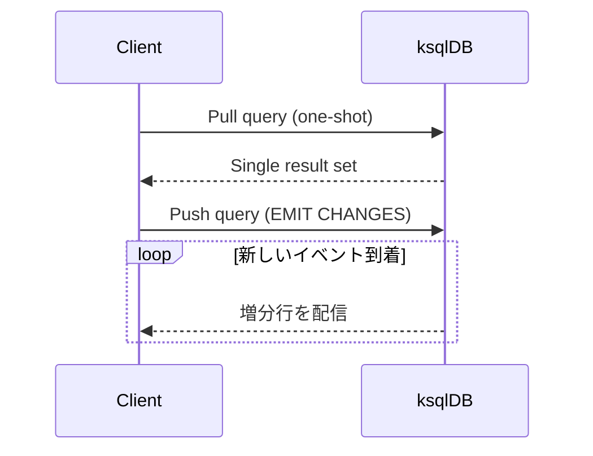

# SQLServer利用者のためのKafka／KSQLDBガイド

本ガイドは、SQLServerの経験を持つ読者が、KafkaとKSQLDB（ksqlDB）の考え方・用語・実装手順を理解し、比較・活用できるように、概念の違いと実務上の要点を日本語でまとめたものです。


## 読み順（全体 → 個別）

1) 概要（全体像を掴む）
2) SQL Server と ksqlDB の対応（概要）
3) Streams vs Tables（概念）
4) Pull vs Push（概念）
5) Retention / latest / earliest（運用の前提）
6) スキーマ運用と DECIMAL（破綻しない型設計）
7) 例で学ぶ（OnModelCreating 最小サンプル）
8) よく使うパターン（リンク集）→ 成功確認チェックリスト

### 早見表（クイックリンク）
- 用語集（SQL Server ⇔ Kafka）: 本ページ末尾の「用語集（SQL Server と Kafka の同名異義語）」
- 関数/型対応表（主要関数）: docs/ksql-function-type-mapping.md
## 概要
本ガイドは、Kafka/ksqlDBの仕組みを理解するために、考え方・用語・クエリの違いを実務目線で整理します。

- SQL Server はトランザクション志向、ksqlDB はイベント志向。
- スキーマ（Avro/Schema Registry）と小数精度の取り扱いが要点。
- クエリは Pull（同期）/Push（非同期）を使い分け、状態（Tables）と履歴（Streams）を意識する。


## できるようになること
- ストリーム（履歴）とテーブル（現在）の違いを使い分ける
- Pull（単発）/ Push（連続）のクエリを正しく選ぶ
- スキーマと DECIMAL 精度を破綻なく運用する
- Retention・latest/earliest の動作を理解して、安全に再処理する

## SQL Server と ksqlDB の対応（概要）
- SQL のテーブル = ksqlDB の TABLE（状態ビュー）。履歴は持たず、最新状態を読む用途。
- SQL のログ/履歴テーブル = Kafka の Topic、ksqlDB の STREAM（事実の連続）。
- SELECT 単発 = Pull Query。SELECT 連続 = Push Query（`EMIT CHANGES`）。
- 主キー/インデックス = Topic のキー（パーティションキー）/ マテビュー（ローカルストア）。

## Streams vs Tables（概念）
- Streams: 事実の列。後からは変えない。「いつ何が起きたか」に強い。
- Tables: 最新状態のビュー。更新・参照が速い。「いまどうなっているか」に強い。
- 実務の指針:
  - 監視・集計・検知 = Stream 起点 → GroupBy/Window → Push
  - 参照・JOIN 基盤 = Table 起点 → Pull（`EMIT CHANGES` なし）

```mermaid
flowchart LR
  subgraph Source
    E[Kafka Topic\nappend-only]
  end
  E -->|CREATE STREAM| S[ksqlDB STREAM]
  S -->|GroupBy/Window| G[Aggregations]
  G -->|EMIT CHANGES| Push[連続結果 (Push)]

  E -->|CREATE TABLE\n(changelog)| T[ksqlDB TABLE]
  T --> Pull[スナップショット (Pull)]
```

## Pull vs Push（概念）
- Pull: いまの答えを1回だけ返す。SQL Server の SELECT に近い。
- Push: 新しいイベントが来るたび更新を流す。通知・監視に向く。
- ksqlDB では、集計や GroupBy を含むものは Push（`EMIT CHANGES`）として扱われる。


```mermaid
sequenceDiagram
  participant C as Client
  participant K as ksqlDB
  C->>K: Pull query (one-shot)
  K-->>C: Single result set
  C->>K: Push query (EMIT CHANGES)
  loop 新しいイベント到着
    K-->>C: 増分行を配信
  end
```

## Retention / latest / earliest（運用の前提）
- Retention（保持期間/サイズ）
  - Topic は「どれだけ長く履歴を持つか」を設定する。期限が来た履歴は削除される。
  - 設計ポイント: 「必要なら作り直す」を前提に、集計は再生成できるよう定義する。
- latest / earliest（初期位置）
  - latest: いま以降に来る新しいメッセージから読む（既存履歴は読まない）。
  - earliest: 可能な限り古い履歴から読む（再処理・検証用）。
  - SQL Server 的に言えば、latest は「テールから追う」、earliest は「全件スキャン」の感覚。
  - 設定例: consumer の `auto.offset.reset=latest|earliest`、ksqlDB では `SET 'auto.offset.reset'='earliest'` やクエリ初回起動時の `FROM BEGINNING` オプションを活用。

## スキーマ運用と DECIMAL（破綻しない型設計）
- Avro + Schema Registry を前提に、互換性（Backward など）を選ぶ。
- DECIMAL は `[KsqlDecimal(p,s)]` で精度/スケールを明示し、スキーマとアプリの一致を守る。

## 例で学ぶ（OnModelCreating 最小サンプル）
- OnModelCreating サンプル（LINQ→KSQL）: `docs/onmodelcreating_samples.md`

## よく使うパターン（リンク集）
- 単純フィルタ＋投影: `docs/onmodelcreating_samples.md#1-単純フィルタ＋投影（pullpushどちらでも）`
- 2ストリーム JOIN（WITHIN 必須）: `docs/onmodelcreating_samples.md#2-2ストリームjoin（within-必須）`
- GroupBy＋集計（Push）: `docs/onmodelcreating_samples.md#3-groupby＋集計（push配信）`
- HAVING 句: `docs/onmodelcreating_samples.md#4-having-句で閾値を絞る`
- TUMBLING 1分窓: `docs/onmodelcreating_samples.md#7-時間窓（tumbling-1分push）`

## 成功確認チェックリスト
- JOIN に `.Within(...)` を付けた（時間制約を明示）
- GroupBy を含むクエリは Push（`EMIT CHANGES`）として動くことを理解した
- DECIMAL の精度/スケールが Avro と一致している
- Retention 設定と再生成方針（作り直せる設計）を合意した
- 再処理は earliest、通常運用は latest を使い分ける

## 付録（詳細編）

## 用語集（SQL Server と Kafka の同名異義語）
一言サマリ: 同名でも意味が異なる用語を最短で照合する。

同じ語でも意味や前提が異なる代表語を、まとまりで把握できるように整理します。まずは「RDBは“現在の状態”、Kafkaは“時系列のイベント”」という大枠を念頭に置いてください。

【データ構造】
- テーブル: SQLServerでは上書き可能な永続表。Kafkaに物理的なテーブルはなく、KSQLのTable（マテリアライズドビュー）が「現在値」を表す論理テーブルに相当。
- トピック: Kafkaの追記型ログ（append-only）。保持期間やコンパクション設定で“見え方”と意味合いが変化。
- キー（Key）: SQLの主キーは行の一意識別。Kafkaのメッセージキーはパーティション決定と集計単位。KTableでは「最後に見た値」が現在値。
- スキーマ: SQLはDB/テーブルの列定義。Kafkaはキー／値ごとのシリアライズスキーマ（Schema Registry）で互換性ルールが重要。

【操作の意味】
- 更新（Update）: SQLは行を上書き。Kafkaは新しいイベントを追加し、KTable視点で“最新が現在値”。
- 削除（Delete）: SQLは行を物理削除。Kafkaは同一キーで値null（tombstone）を出し、コンパクションで論理削除を反映。
- トランザクション: SQLはACIDで強一貫性。KafkaはProducer/Consumerトランザクションで「1回だけ（EOS）」や整合を担保するが性質は異なる。
- コミット: SQLはトランザクション確定。Kafkaはコンシューマのオフセットコミット（読み取り位置の確定）と、Producerトランザクションのコミットがある。

【参照と一貫性】
- クエリ: SQLは要求-応答の一発取得。KSQLはPull（スナップショット）とPush（変化を流し続ける）の二系統。
- ジョイン: SQLは任意時点の関係結合。KafkaはS-S（ストリーム-ストリーム）とS-T（ストリーム-テーブル）で、時間と順序が本質。
- 一貫性: SQLは強一貫性が標準。Kafkaは最終的整合性の文脈が多く、到着順や遅延の影響を考慮。

【スケーリングと検索】
- パーティション: SQLの表分割に類似するが、Kafkaでは並列度と順序の最小単位（キーで割当）。
- インデックス: SQLは検索構造を表に持つ。Kafkaトピック自体にインデックスはなく、KTableのステートストア（例: RocksDB）が「現在値の検索」を担う。

## KSQL DDL と Avro スキーマ
一言サマリ: 作成/生成の最小例と、Avro運用の要点だけ掴む。

本ガイドのKSQL例はAvroで統一します（Schema Registry前提）。

```sql
-- ストリーム定義（Avro）
CREATE STREAM orders_stream (
    OrderID STRING,
    CustomerID STRING,
    Amount DECIMAL(10,2),
    OrderTime TIMESTAMP
) WITH (
    KAFKA_TOPIC = 'orders',
    VALUE_FORMAT = 'AVRO'
);

-- テーブル定義（Avro）
CREATE TABLE customers (
    CustomerID STRING PRIMARY KEY,
    Name STRING,
    Email STRING
) WITH (
    KAFKA_TOPIC = 'customers',
    VALUE_FORMAT = 'AVRO'
);

-- 集計テーブル（CTAS）
CREATE TABLE customer_orders AS
SELECT
    CustomerID,
    COUNT(*) AS OrderCount,
    SUM(Amount) AS TotalAmount
FROM orders_stream
GROUP BY CustomerID
EMIT CHANGES;
Avroのポイント:
- スキーマ駆動のバイナリ形式で軽量・高速。メッセージにはスキーマID（Confluentワイヤフォーマット）が付与され、Schema Registryから解決されます。
- Subject名は通常 `<topic>-value` と `<topic>-key`。キー/値で別スキーマを管理できます（必要に応じて `KEY_FORMAT = 'AVRO'` の指定も可）。
- 互換性モードは BACKWARD／FORWARD／FULL など。後方互換を保つ変更（フィールド追加にデフォルト付与、nullable化）を基本とします。
- 代表的な論理型: DECIMAL/DATE/TIME/TIMESTAMP。KSQLの  `DECIMAL(p,s)` は Avro の `bytes` + `logicalType: decimal` に対応します。 
- 注意: ksqlDBでDECIMAL型を使うには  `VALUE_FORMAT =  'AVRO' ` が前提です（JSON/Delimited では非対応または非推奨）。 

補足:
- Avroの互換性はSchema Registryの設定（BACKWARD／FORWARD／FULL 等）に従います。
- 必要に応じて `KEY_FORMAT` を指定します。本ガイドの最小例では省略しています。


## KSQLの基本説明
一言サマリ: 概念の差を短くおさらい（Stream/Table、Pull/Push、Window）。

- ストリーム（STREAM）: 追記され続けるイベントの流れ。Pushクエリで変化を監視可能。
- テーブル（TABLE／KTable）: 現在値を表す論理テーブル。Pullクエリでスナップショットを取得可能。
- クエリ種別: Pull（1回取得）／Push（`EMIT CHANGES` で継続出力）。
- ウィンドウ: TUMBLING／HOPPING／SESSION など。時間と順序が本質（特にS-S Join）。
- ジョイン（やさしい説明）:
  - S-S（ストリーム-ストリーム）: 「一定時間内に到着したもの同士」を結びつけるため、時間窓の指定が必須。
  - S-T（ストリーム-テーブル）: 「到着時点のテーブルの最新値」を参照。到着順や遅延が結果に影響。

### ウィンドウの可視化（Mermaid）

TUMBLING（固定幅・重なりなし）

```mermaid
gantt
dateFormat  HH:mm
axisFormat  %H:%M
section Tumbling(5m)
W1 :a1, 00:00, 5m
W2 :a2, 00:05, 5m
W3 :a3, 00:10, 5m
```
HOPPING（固定幅・重なりあり、ステップ=2分の例）

```mermaid
gantt
dateFormat  HH:mm
axisFormat  %H:%M
section Hopping(Win=5m, Step=2m)
W1 :b1, 00:00, 5m
W2 :b2, 00:02, 5m
W3 :b3, 00:04, 5m
```

SESSION（アイドル時間で区切る）

```mermaid
gantt
dateFormat  HH:mm
axisFormat  %H:%M
section Session(gap=2m)
Session1 :c1, 00:00, 3m
Session2 :c2, 00:05, 4m
```
## KSQLで使用できる関数（概要）
一言サマリ: よく使う分類を俯瞰。詳細は対応表へ。

- 集約: `SUM`、`AVG`、`COUNT`、`MIN`、`MAX`、`TOPK`、`COLLECT_LIST`
- 文字列: `LCASE`、`UCASE`、`LEN`
- オフセット系: `EARLIEST_BY_OFFSET`、`LATEST_BY_OFFSET`
- ウィンドウ: `WINDOW TUMBLING`／`HOPPING`／`SESSION`（クエリ側で指定）
### 補足: オフセット系関数の考え方（SQLServerにはない概念）
一言サマリ: 物理到着順（offset）ベースで値を選ぶ点に注意。


- Kafkaでは各レコードにパーティション内連番の「offset」が付与されます。オフセット系関数は、この物理順序（到着順）に基づいて値を選びます。
- EARLIEST_BY_OFFSET(col): グループ（またはウィンドウ）内で、最も早いオフセットの行の col を返す（値が最小とは限らない）。
- LATEST_BY_OFFSET(col): グループ（またはウィンドウ）内で、最も遅いオフセットの行の col を返す（値が最大とは限らない）。
- SQLServerに近い直感で言うと、ORDER BY 物理到着順 + TOP(1) のイメージですが、RDBには「トピックの物理順序」や「オフセット」の概念がない点が違いです。

例: ウィンドウ内で最新到着の金額を取得
```sql
SELECT
  CustomerID,
  LATEST_BY_OFFSET(Amount) AS LastAmount
FROM orders_stream
WINDOW TUMBLING (SIZE 5 MINUTES)
GROUP BY CustomerID
EMIT CHANGES;
```

詳細な型対応や制約は個々の関数ドキュメントに従ってください。

## KSQL関数とデータ型の対応表（主要関数）
一言サマリ: SQL Server からの置き換えを一覧で確認。

- 詳細な対応表は docs/ksql-function-type-mapping.md を参照
