# Key-Value Flow Architecture (POCO ↔ Kafka)

## 1. 概要

本資料は、Query namespace に定義された POCO および LINQ式から Kafka へ送信するフロー（Produce）と、Kafka から受信して POCO に復元するフロー（Consume）を一貫して設計するための責務分解図である。

---

## 2. 全体構造図（双方向）

[Query] ⇄ [KsqlContext] ⇄ [Messaging] ⇄ [Serialization] ⇄ [Kafka]


## 3. Produce Flow（POCO → Kafka）

[Query/EntitySet<T>]
↓ LINQ式, POCO
[KsqlContext/ExtractKeyValue()]
↓ T → key, value
[Messaging/IKafkaProducer<T>.Produce()]
↓ key, value
[Serialization/AvroSerializer]
↓ byte[]
[Kafka]
→ Topic送信

yaml
コピーする
編集する

### 🧱 責務一覧

| レイヤー     | クラス名             | 主な責務                                  |
|--------------|----------------------|-------------------------------------------|
| Query        | EntitySet<T>         | LINQ式とPOCOを提供                         |
| KsqlContext  | ExtractKeyValue()    | LINQ式に基づく key-value抽出              |
| Messaging    | IKafkaProducer<T>    | メッセージ送信、トピック指定              |
| Serialization| AvroSerializer       | key/value の Avro変換（Confluent）        |
| Kafka        | Kafka Broker         | メッセージ配信                            |

---

## 4. Consume Flow（Kafka → POCO）

[Kafka]
↓ メッセージ受信
[Serialization/AvroDeserializer]
↓ key, value（byte[] → object）
[Messaging/IKafkaConsumer<TKey, TValue>]
↓ POCO再構成（TKey, TValue）
[Application/Callback or Pipeline]
→ アプリケーションロジックへ渡す


### 🧱 責務一覧

| レイヤー     | クラス名               | 主な責務                                     |
|--------------|------------------------|----------------------------------------------|
| Kafka        | Kafka Broker           | メッセージ受信                                |
| Serialization| AvroDeserializer       | Avro → POCO 変換（Confluent）                |
| Messaging    | IKafkaConsumer<TKey, TValue> | メッセージ処理, POCO復元                 |
| Application  | Consumer Handler       | アプリロジックへの通知・後処理              |

---

## 5. 注意点

- 全体のKey定義はLINQ式で統一（POCOの属性依存を排除）。
- key/valueのAvro変換はConfluent公式に完全依存。
- `IKafkaConsumer` は再生成されたTKey/TValueの型安全性を保持。
- 各構成はDIにより初期化、KsqlContextが統括。

## 6. 利用シナリオ: EntitySet から Messaging まで

LINQ クエリをどのように `Kafka` 配信までつなぐかを示すため、代表的なシーケンスとコード例を以下にまとめる。

## 7. 運用フロー詳細

1. POCO定義・LINQ式生成
    - Query namespaceでPOCO（およびLINQ式）を受け付け、key/valueプロパティ配列を取得。
    - keyが未指定の場合は、Query層でGuidを自動割当。
1. Mapping登録処理
    - KsqlContextが、POCO＋key/value情報をMappingに一括登録。
    - DLQ POCOもCore namespaceから登録（produce専用）。
1. KSQLクラス名生成
    - POCOのnamespace＋クラス名から一意なKSQL schema名を生成。
    - スキーマ登録時と必ず一致する仕様で統一。
1. スキーマ登録
    - schema registryに対し、KSQLクラス名でスキーマを登録。
1. インスタンス生成
    - POCO単位でMessaging/Serializationインスタンスを生成。
    - OnModelCreating直後に必ず上記一連の処理を実施。


### シーケンス図

```mermaid
sequenceDiagram
    participant App as Application
    participant Query as EntitySet<T>
    participant Builder as QueryBuilder
    participant Mapping as MappingManager
    participant Context as KsqlContext
    participant Msg as KafkaProducer
    App->>Query: LINQクエリ作成
    Query->>Builder: 式ツリー解析
    Builder->>Mapping: モデル問い合わせ
    Mapping->>Context: key/value生成
    Context->>Msg: Produce(key, value)
```



### サンプルコード

```csharp
var ctx = new MyKsqlContext(options);
var set = ctx.Set<User>();

var query = set.Where(u => u.Id == 1);
var builder = new QueryBuilder(ctx.Model);
var mapping = ctx.MappingManager;

var ksql = builder.Build(query);
var entity = new User { Id = 1, Name = "Alice" };
var parts = mapping.ExtractKeyParts(entity);
var key = KeyExtractor.BuildTypedKey(parts);
await ctx.AddAsync(entity, headers: new Dictionary<string, string> { ["is_dummy"] = "true" });
```

複合キーは `List<(string KeyName, Type KeyType, string Value)>` として抽出し、送信時に `BuildTypedKey` で型変換する方式へ移行しました。既存の `ExtractKeyValue` は互換APIとして残ります。

### ベストプラクティス

- `MappingManager` へ登録するモデルは `OnModelCreating` で一括定義する。
- `QueryBuilder` から返される KSQL 文はデバッグログで確認しておく。
- `KsqlContext` のライフサイクルは DI コンテナに任せ、使い回しを避ける。

### アンチパターン

- `MappingManager` を毎回 `new` して登録し直す。 → モデル漏れや性能低下につながる。
- LINQ クエリ側で複雑なロジックを組み込み、`QueryBuilder` の解析失敗を誘発する。

### 異常系の流れ

1. `MappingManager` に登録されていないエンティティを渡した場合、`InvalidOperationException` が発生する。
2. `KsqlContext` との接続に失敗した場合は `KafkaException` を上位へ伝搬する。

## 8. 型情報・設計情報管理フロー

### 8.1 PropertyMetaによる型情報一元管理
- 各POCOプロパティの型・精度（decimal）・フォーマット（KsqlDatetimeFormat等）・属性情報は**PropertyMeta（PropertyInfo＋Attribute配列）**にまとめて保持する。
- PropertyMetaはFluentAPI設定や設計フェーズで決定され、コード属性やリフレクションには依存しない。

### 8.2 Mappingによるkey/valueクラス自動生成・登録
- Mappingは、POCO＋PropertyMeta[]を受け取り、key/valueごとに内部クラス型（KeyType/ValueType）を動的生成し登録する。
- 登録時、KeyType/ValueTypeとPropertyMeta[]を`KeyValueTypeMapping`として一元管理する。取得APIは`GetMapping(Type pocoType)`が基本となる。
- 設計情報の唯一の出入口はMappingであり、他namespaceはこの情報のみ参照することが公式ルール。
- KeyType / ValueType の型名・名前空間は ksqlDB スキーマ登録時の命名規約と一致させること。
- スキーマ名は POCO の完全修飾名を小文字化し、key は "-key"、value は "-value" を付与した形式とする。

### 8.3 Serialization/Deserializationの流れ
- シリアライズ/デシリアライズ時はMappingからkey/value型＋PropertyMeta[]を取得し、Confluent.Avro公式ライブラリで変換処理を行う。
- POCO⇄key/value⇄バイト列の流れで、型安全・設計一貫性を担保。
- POCO⇄key/valueの変換は`KeyValueTypeMapping`提供のAPIを用い、POCO型へのリフレクションや独自探索を行わない。

### 8.4 Messaging層の責務
- `KafkaProducerManager` と `KafkaConsumerManager` が `PocoMapper` を介して POCO と key/value の Avro 変換を行う。
- `Serializer` と `Deserializer` は生成後にキャッシュされ、高頻度の送受信にも耐えられるよう最適化される。
- DLQ (Dead Letter Queue) 送信は Messaging 経由で行うが、エンベロープ生成やポリシー判断は Core 層が担当する。
- 型情報やスキーマ管理は Mapping/Serialization 層に集約し、Messaging 層はそれらを利用するだけのシンプルな構造を維持する。

### 8.5 設計進化時の運用ポイント
- 新しいPOCOや属性、精度/フォーマットの追加もMappingへの登録・PropertyMeta反映だけでOK。
- 既存MessagingやSerializationの実装変更は原則不要。

### 8.6 補足：設計フロー図・サンプルコード
■ シーケンス図（Mermaid記法）

```mermaid
sequenceDiagram
    participant App as Application
    participant Query as QueryProvider
    participant Ksql as KsqlContext
    participant Map as Mapping
    participant Ser as Serialization
    participant Msg as Messaging

    App->>Query: POCO/クエリ定義
    Query->>Ksql: PropertyMeta[]（key/value情報）取得
    Ksql->>Map: RegisterMapping(pocoType, keyMeta[], valueMeta[])
    Map->>Map: KeyType/ValueType自動生成＋登録

    App->>Ser: POCOインスタンス渡す
    Ser->>Map: Key/Value型＋PropertyMeta取得
    Ser->>Ser: Avroでserialize/deserialize（keyType/valueType）

    Ser->>Msg: バイト列(keyBytes, valueBytes)送信
    Msg->>Kafka: publish/consume（トピック単位）
```


■ サンプルコード（C#擬似例）

```
// 1. PropertyMetaの取得とMapping登録
var keyMeta = queryProvider.GetKeyProperties(typeof(User));
var valueMeta = queryProvider.GetValueProperties(typeof(User));
mappingManager.RegisterMapping(typeof(User), keyMeta, valueMeta);

// 2. POCO → key/value 型への分割
var mapping = mappingManager.GetMapping(typeof(User));
var keyInstance = mapping.ExtractKey(userPoco);   // keyPropertyMeta[]を元にKeyTypeへ変換
var valueInstance = mapping.ExtractValue(userPoco);

// 3. Avroでシリアライズ/デシリアライズ
var keyBytes = avroSerializer.Serialize(keyInstance, mapping.KeyType);
var valueBytes = avroSerializer.Serialize(valueInstance, mapping.ValueType);

var restoredKey = avroSerializer.Deserialize(keyBytes, mapping.KeyType);
var restoredValue = avroSerializer.Deserialize(valueBytes, mapping.ValueType);

// 4. Messaging経由で送受信
await messagingProducer.PublishAsync(keyBytes, valueBytes, topic);
// 受信例
var (recvKeyBytes, recvValueBytes) = await messagingConsumer.ConsumeAsync(topic);
// POCO復元（必要に応じてCombineFromKeyValueで統合）
```
■ ポイント
設計フロー・サンプルコードとも「PropertyMeta管理→Mapping→型生成→Avro変換→Messaging」の流れが“一本化”

すべての型情報・設計情報は Mapping が一元管理し、Messaging 層では `KafkaProducerManager` と `KafkaConsumerManager` が Avro 変換を行う


ドキュメント・設計書にも「型情報・設計情報の一元管理＝Mapping」ルールを明記すること。